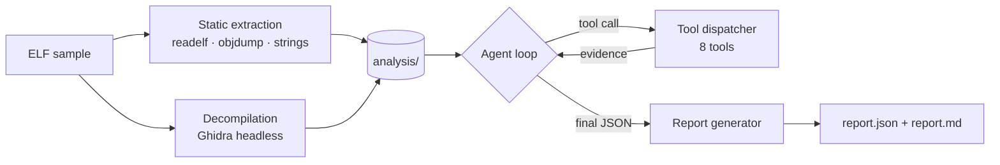

# Ioznizer

**LLM-driven reverse engineering for ELF binaries.**

Ioznizer decompiles a Linux binary with Ghidra, then hands a language model the
same tools a reverse engineer would reach for — function listings, pseudo-C,
disassembly, symbol tables, string search — and lets it drive its own
investigation. The output is an analyst-grade report with evidence-linked
findings, IOCs, MITRE ATT&CK mapping and draft YARA rules.

---

## Why tool-driven analysis

The obvious way to point a model at a binary is to dump `strings`, `readelf -a`
and `objdump -d` into a prompt. A 110 KB stripped ELF produces well over a
megabyte of text — far past any context window — so you truncate, and the model
reasons about an arbitrary first slice of the disassembly.

Ioznizer inverts that. The model gets a compact overview and then **asks for what
it needs**, one question at a time:

```
search_strings("syn_flood")     → 4 hits in .rodata
list_functions()                → 267 functions recovered
decompile_function("FUN_0804a330")

    uVar3 = FUN_08059d98();
    FUN_0805a35d("[syn_flood] started: ('%d')\n", uVar3);
    iVar4 = FUN_0805bdbe(2, 3, 6);        // socket(AF_INET, SOCK_RAW, IPPROTO_TCP)
    if (iVar4 == -1) {
      FUN_0805a2e1("[syn_flood] socket() failed");
```

A raw TCP socket built for SYN flooding — read directly from decompiled code, in
a stripped binary with no symbols. This is hypothesis-driven investigation, and
it stays within context regardless of binary size.

Every report records which tools the model chose and why, so its reasoning is
auditable rather than opaque.

---

## Pipeline



**1 — Static extraction.** Validates the ELF magic, reads the machine type from
the header and passes the matching `-m` flag to `objdump`; without it,
disassembly silently fails on ARM, MIPS, PowerPC and SPARC samples. Symbols are
read with `readelf -s -W`, where `-W` prevents the truncation that otherwise
turns `__libc_start_main` into `_[...]`.

**2 — Decompilation.** Ghidra headless runs a `GhidraScript` that exports
pseudo-C for every recovered function. radare2 is supported as a fallback.

**3 — Agent loop.** The model calls tools, the dispatcher executes them against
the extracted artifacts, results feed back. The loop reserves its final
iterations for the verdict itself, and accepts a response as final only when it
parses as a schema-valid report.

**4 — Report generation.** Structured JSON plus a readable Markdown report.

### Tools available to the model

| Tool | Purpose |
|---|---|
| `list_functions` | Every function recovered by the decompiler, with entry points |
| `decompile_function` | Pseudo-C for one function, by name or address |
| `disassemble_address` | Raw disassembly at an address, range or symbol |
| `read_section` | Paged reads of metadata / strings / symbols / disasm / decomp |
| `search_strings` | Case-insensitive pattern search across extracted strings |
| `analyze_symbol` | Full symbol-table detail for one symbol |
| `get_imports` | Undefined symbols plus `DT_NEEDED` shared libraries |
| `get_exports` | Symbols the binary itself defines |

---

## Results

Two binaries, identical pipeline, no tuning between runs. Both were analysed
with the free default model (`openai/gpt-oss-20b:free`) — see
[Choosing a model](#choosing-a-model) to run the same pipeline against a
stronger one.

### Sample A — stripped 32-bit ELF, unknown provenance

Ghidra recovered **267 functions with zero decompilation failures** in ~47
seconds. The model's verdict:

```
classification : Distributed Denial of Service (DDoS) Tool / Network Flooder
risk           : High  (85/100)
binary         : i386, statically linked, imports: []
capabilities   : SYN flood · UDP flood · ICMP flood · TCP ACK flood
                 SSDP discovery · infinite execution loop
```

Findings it evidenced from the code:

- **Flood primitives** — located `[udp_flood]`, `[syn_flood]`, `[icmp_flood]` in
  `.rodata`, then confirmed the raw-socket construction and send loops in the
  decompiled functions behind them.
- **Reconnaissance** — SSDP `M-SEARCH` broadcast to `255.255.255.255:1900`.
- **Direct syscalls** — an empty import table with no `DT_NEEDED` entries, which
  the tooling reports explicitly as a statically linked binary calling syscalls
  directly rather than as missing data.

Independently checkable: `file` reports *ELF 32-bit LSB, Intel i386, statically
linked, stripped*, and `readelf` confirms the empty dynamic symbol table.

### Sample B — benign control

The control matters as much as the detection. Run against an ordinary local
utility, `decompile_function("read_msg")` returns essentially the original
source:

```c
void * read_msg(void)
{
  __stream = fopen("msg.txt","rb");
  if (__stream == (FILE *)0x0) {
    puts("msg.txt is missing");
    exit(1);
  }
  fseek(__stream,0,2);
  local_10 = ftell(__stream);
  __ptr = malloc(local_10 + 1);
  fread(__ptr,1,local_10,__stream);
  fclose(__stream);
  ...
```

The model classified it as a benign utility with an **empty**
`malicious_behaviors` array — no inflated risk score, no invented C2. A tool
that flags everything is worthless; this is the run that shows it doesn't.

### Report schema

```
executive_summary        classification · risk_level · risk_score · evasion techniques
technical_analysis       binary properties · malicious_behaviors[] with evidence_location
                         and confidence_level · network capabilities · persistence
indicators_of_compromise network IOCs · host IOCs · behavioral IOCs · YARA rules
threat_intelligence      MITRE ATT&CK techniques · actor / campaign attribution
tool_usage_analysis      tools used · investigation strategy · key findings
recommendations          detection · mitigation · further analysis
```

Every entry in `malicious_behaviors` carries an `evidence_location` and a
`confidence_level`, so a reviewer can go straight to the address or function and
check the claim.

---

## Install

**Requirements:** Python 3.9+, GNU binutils (`readelf`, `objdump`, `strings`),
and a decompiler.

```bash
git clone https://github.com/nizaryart/Ioznizer.git
cd Ioznizer
python3 -m venv venv && source venv/bin/activate
pip install -r requirements.txt
```

### Ghidra (recommended)

```bash
sudo apt install -y openjdk-21-jdk
cd /opt
sudo wget https://github.com/NationalSecurityAgency/ghidra/releases/download/Ghidra_12.1.2_build/ghidra_12.1.2_PUBLIC_20260605.zip
echo "b62e81a0390618466c019c60d8c2f796ced2509c4c1aea4a37644a77272cf99d  ghidra_12.1.2_PUBLIC_20260605.zip" | sha256sum -c -
sudo unzip -q ghidra_12.1.2_PUBLIC_20260605.zip
export GHIDRA_HOME=/opt/ghidra_12.1.2_PUBLIC
```

If Ghidra runs on a JDK other than 21, pin it:

```bash
echo 'JAVA_HOME_OVERRIDE=/usr/lib/jvm/java-21-openjdk-amd64' >> "$GHIDRA_HOME/support/launch.properties"
```

radare2 (`apt install radare2`) works as a fallback and is selected
automatically if Ghidra is not found.

### API key

```bash
cp .env.example .env      # then add your OpenRouter key
```

The key is read from the environment only — never committed, and redacted in
logs.

## Usage

```bash
./run.sh samples/your_sample.elf
# or
python3 main.py samples/your_sample.elf
```

Output:

```
analysis/*.txt                  static extraction + decompilation
reports/<name>_<timestamp>.json structured verdict
reports/<name>_<timestamp>.md   readable report
```

If the decompiler is unavailable or the API call fails, extraction still
completes and the report says exactly what was missing — the pipeline degrades
rather than guessing.

### Configuration

| Variable | Default | Purpose |
|---|---|---|
| `OPENROUTER_API_KEY` | — | Required for LLM analysis |
| `OPENROUTER_MODEL` | `openai/gpt-oss-20b:free` | Any tool-calling model |
| `GHIDRA_HOME` | auto-detected | Ghidra installation root |
| `DECOMPILER_BACKEND` | auto | Force `ghidra`, `radare2` or `none` |
| `DECOMPILER_TIMEOUT` | `900` | Seconds before decompilation is abandoned |
| `IOZNIZER_SANDBOX` | `1` | Run the decompiler under `bwrap` |
| `MAX_ANALYSIS_ITERATIONS` | `20` | Agent loop ceiling |

### Choosing a model

The model is entirely your choice — anything on OpenRouter that supports tool
calling will drive the pipeline:

```bash
export OPENROUTER_MODEL="openai/gpt-oss-20b:free"     # free, no cost per run
export OPENROUTER_MODEL="anthropic/claude-sonnet-4.5" # or any paid model
```

The default is a free tool-calling model, so a full analysis costs nothing to
run. Depth of analysis scales with the model: larger models follow longer chains
of reasoning through the decompiled code, cite more precise evidence and produce
richer ATT&CK mappings. The tool layer is identical either way — the same eight
tools, the same extracted artifacts — so you can start free and move to a
stronger model when a sample warrants it.

To list the free tool-calling models currently available:

```bash
curl -s https://openrouter.ai/api/v1/models \
  | jq -r '.data[] | select(.id|endswith(":free"))
           | select(.supported_parameters|index("tools"))
           | "\(.id)  ctx=\(.context_length)"'
```

---

## Handling untrusted binaries

Ioznizer performs **static analysis only**. Nothing in the pipeline executes the
sample — the decompiler parses and lifts it, and that is the extent of the
interaction.

As defence in depth against a malformed binary targeting the analyser's own
parsers, decompilation runs under `bwrap` when available: no network
(`--unshare-net`), a scratch home, and the sample staged in read-only at mode
`0400`. Live samples are never committed to this repository; see
[`samples/README.md`](samples/README.md).

Findings are model-generated and evidence-linked by design — each one names the
function or address it came from, so it can be verified against the binary
before it informs a decision.

## Project layout

```
main.py                     orchestrates extraction, analysis, reporting
config.py                   environment-driven configuration
backend/extractor.py        ELF validation, arch detection, static extraction
backend/decompiler.py       Ghidra / radare2 backends, sandboxing
backend/ghidra_scripts/     GhidraScript that exports pseudo-C
agent/analyze.py            iterative agent loop and convergence control
agent/openrouter_client.py  API client, retries, backoff
agent/tool_dispatcher.py    executes model tool calls
agent/tools_schema.py       tool definitions
agent/report_generator.py   JSON extraction, validation, rendering
samples/                    benign control sample + sourcing notes
```

## License

MIT — see [LICENSE](LICENSE).

---

Built by [Nizar](https://github.com/nizaryart) — cybersecurity engineer working
on malware analysis, detection engineering and applied AI for security
operations.
